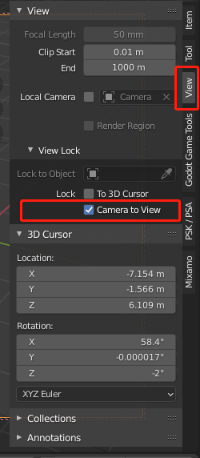

- Shift + Z   切换wireframe显示 和 Solid  
- Alt + Z     开启/关闭X-Ray 模式  
- Numpad.5    toggle 透视、orthographic模式  
- Numpad.0    摄像机视图   
> 使用摄像机视图时候，可以打开`Camera to view`以camera为中心进行旋转平移缩放  
> 

- G           移动视图，当视图在摄像机模式时，摄像机平移
