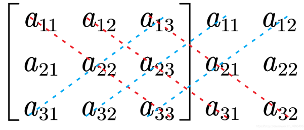
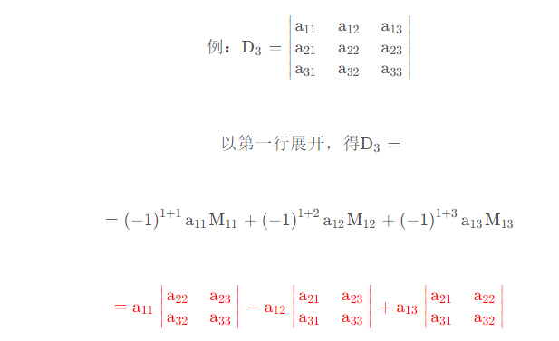
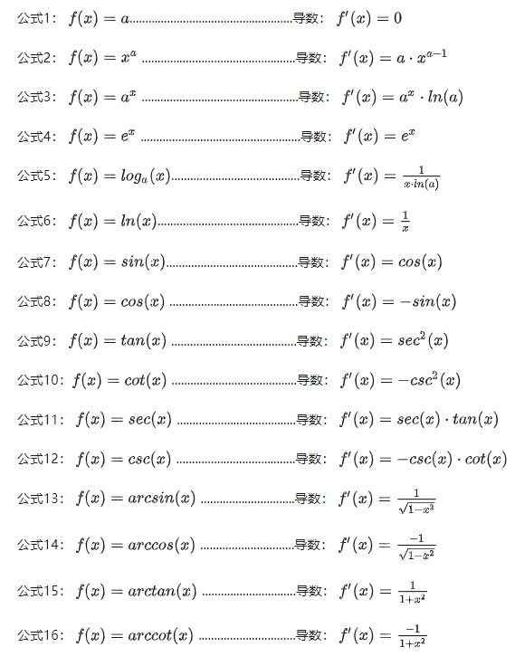
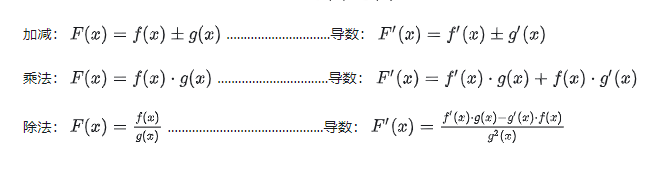
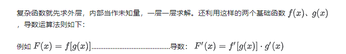

### 矩阵

1. det(R) 矩阵行列式 (代数余子式法、对角线法、等价转换法、逆序数法)  

定义： n阶行列式
$$
 \left[
 \begin{matrix}
   a_{11} & a_{12} & ... & a_{1n} \\
   a_{21} & a_{22} & ... & a_{2n} \\
   a_{31} & a_{32} & ... & a_{3n} \\
   a_{n1} & a_{n2} & ... & a_{nn}
  \end{matrix}
  \right] \tag{1}
$$
等于所有取自不同行不同列的n个元素的乘积
$$
    a_{1j_{1}}a_{2j_{2}}a_{3j_{3}}...a_{nj_{n}}
$$
的代数和。
> 其中`j1j2..jn`是矩阵的列，比如：  
> $$ a_{11}*a_{22}*a_{33}...*a_{nn} $$

每一项都按如下规则带有符号：  
当$j_{1...n}是偶排列时带有正号$，当$j_{1...n}$是奇排列带时带有负号，这一定义可以写为：  
$$
 \left[
 \begin{matrix}
   a_{11} & a_{12} & ... & a_{1n} \\
   a_{21} & a_{22} & ... & a_{2n} \\
   a_{31} & a_{32} & ... & a_{3n} \\
   a_{n1} & a_{n2} & ... & a_{nn}
  \end{matrix}
  \right] \tag{2}
  =
  \sum_{j_1j_2...j_{n}}(-1)^{t(j_{1}...j_{n})}a_{1j_{1}}a_{2j_{2}}a_{3j_{3}}...a_{nj_{n}}
$$

> $t(j_{1}...j_{n})$表示排列$j_1j_2...j_{n}$的逆序数。

### 行列式求法

1. 对角线法

红色相加，蓝色相减

2. 代数余子法  

## 李群与李代数

- 三维旋转举证称为**特殊正交群SO(3)**

- 变换矩阵称为**特殊欧式群SE(3)**

他们对加法不封闭，对乘法封闭。

**群** 是一种集合加上一种运算的代数结构。
> 群记作`A`，运算记作`.` `G=(A,.)`

1. 封闭性 $\forall_{a1,a2}\varepsilon A,a1.a2 \varepsilon A.  $
2. 结合律
3. 幺元
4. 逆

***基础导数公式***

***导数基本运算法则***

***复杂函数***

